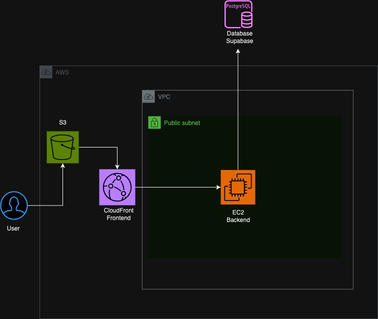

# Documentação da API REST para AlluTools

Abaixo está a documentação simplificada para uma API REST desenvolvida em Node.js para o aplicativo AlluTools. As rotas são organizadas com base nas tabelas Products, User e Orders.



## Instale as dependências

    npm install

## Configuração do Ambiente

Antes de iniciar a aplicação, é necessário configurar as variáveis de ambiente. Para isso:

1. Crie um arquivo `.env` na raiz do projeto.
2. Adicione as seguintes chaves com seus respectivos valores:

        DB_HOST=<Seu Host>
        DB_DATABASE=postgres
        DB_USERNAME=<Seu Usuário>
        DB_PASSWORD=<Sua Senha>

## Rode a API

    npm run dev
    
## Tabelas:

### Products

- **id** (INTEGER) - ID do produto.
- **title** (STRING) - Nome do produto.
- **content** (STRING) - Descrição do produto.
- **image** (STRING) - URL da imagem do produto.
- **price** (INTEGER) - Preço do produto.
- **volts** (STRING) - Voltagem.
- **watts** (STRING) - Potência em Watts.
- **usability** (STRING) - Utilidade.
- **condition** (STRING) - Condição do produto.
- **brand** (STRING) - Marca.

### User

- **id** (INTEGER) - ID do usuário.
- **name** (STRING) - Nome do usuário.
- **email** (STRING) - Email do usuário.
- **password** (STRING) - Senha do usuário.
- **document** (STRING) - Documento do usuário.

### Orders

- **userId** (INTEGER) - ID do usuário relacionado ao pedido.
- **productId** (INTEGER) - ID do produto relacionado ao pedido.

## Endpoints:

### Autenticação

#### **POST** `/login`

Autentica um usuário.

- **Body**: 

  ```json
  {
    "email": "usuario@email.com",
    "password": "senha"
  }

#### Respostas
- **200 OK** - Retorna o token de autenticação..
- **401 Unauthorized** - Credenciais inválidas.

### Produtos

#### **GET** `/products`

Buscar todos os produtos disponíveis.

#### Query Params:
- **search** (opcional): Para filtrar produtos por nome ou descrição.
- **orderBy** (opcional): Para ordenar os resultados.

#### Respostas
- **200 OK** - Retorna uma lista de produtos.
- **500 Internal Server Error** - Erro no servidor.

#### **POST** `/products`

Adicionar um novo produto.

- **Body**: 

  ```json
  {
  "title": "Nome do Produto",
  "content": "Descrição do Produto"
  }

#### Respostas
- **201 Created** - Produto criado com sucesso.
- **500 Internal Server Erro** -  Erro no servidor.

### Usuários

#### **GET** `/users`

Obter todos os usuários.

#### Respostas
- **200 OK** - Retorna uma lista de usuários.
- **500 Internal Server Error** - Erro no servidor.

#### **GET** `/users/:id`
Obter detalhes de um usuário específico.

#### Respostas
- **200 OK** - Retorna detalhes do usuário.
- **404 Not Found** - Usuário não encontrado.
- **500 Internal Server Error** - Erro no servidor.

#### **POST** `/users`
Criar um novo usuário.

- **Body**: 

  ```json
  {
  "name": "Nome do Usuário",
  "email": "email@email.com",
  "password": "password",
  "document": "123.456.789-00"
  }

#### Respostas
- **201 Created** - Usuário criado com sucesso.
- **409 Conflict** - Email já registrado.
- **500 Internal Server Erro** -  Erro no servidor.

### Pedidos

#### **GET** `/orders/:userId`

Buscar todos os pedidos de um usuário específico.

#### Respostas
- **200 OK** - Retorna uma lista de pedidos.
- **404 Not Found** - Pedidos não encontrados para o usuário.
- **500 Internal Server Error** - Erro no servidor.

#### **GET** `/users/:id`
Obter detalhes de um usuário específico.

#### Respostas
- **200 OK** - Retorna detalhes do usuário.
- **404 Not Found** - Usuário não encontrado.
- **500 Internal Server Error** - Erro no servidor.

#### **POST** `/orders`
Criar um novo pedido.

- **Body**: 

  ```json
  {
  "products": "[1,2,3]",
  "userId": "idDoUsuario"
  }

#### Respostas
- **201 Created** - Pedido criado com sucesso.
- **400 Bad Request** - Não foi possível criar o pedido.
- **500 Internal Server Erro** -  Erro no servidor.

### Nota: 

Todas as rotas (exceto a de login) requerem autenticação via token JWT. O token deve ser fornecido no cabeçalho da requisição como "Authorization". Além disso, a validação adequada do email e senha é necessária ao criar um novo usuário, conforme indicado pelos middlewares emailValidation e passwordValidation
  
